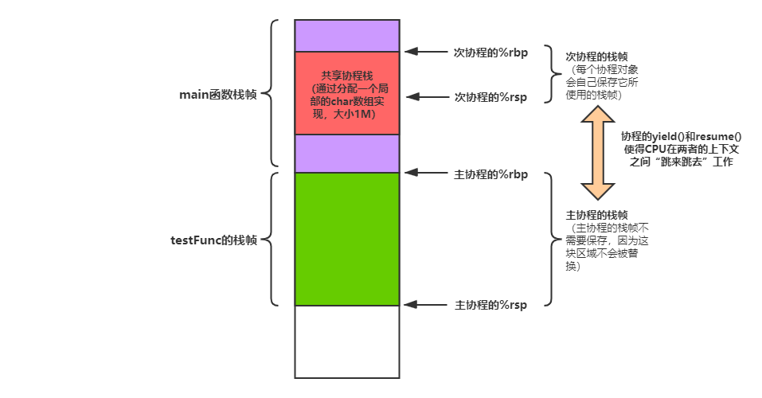

# FakeCoroutine

参照云风前辈的[coroutine](https://github.com/cloudwu/coroutine.git)实现的简易协程，做了一点封装。如果看过这个实现，你就会发现各种论坛上谈论如何如何牛逼的协程其实非常简单，即（借助`uncontext`系列函数）**在不切换到内核态的前提下，进程自己保存并替换用户上下文，主要就是针对CPU寄存器**（特别是栈基指针%rbp和栈顶指针%rsp）**和当前函数的过程栈帧**，从而实现在单个线程执行流在多个协程函数之间的“跳来跳去”😋。是的，类似于`sig_longjmp()`这样的非局部跳转函数（它好像也是可以实现协程的）。

这样的共享栈协程实现大致的图示如下（应该是这样的😂），具体细节分析，等找到工作后再说吧🙏！！！

    

